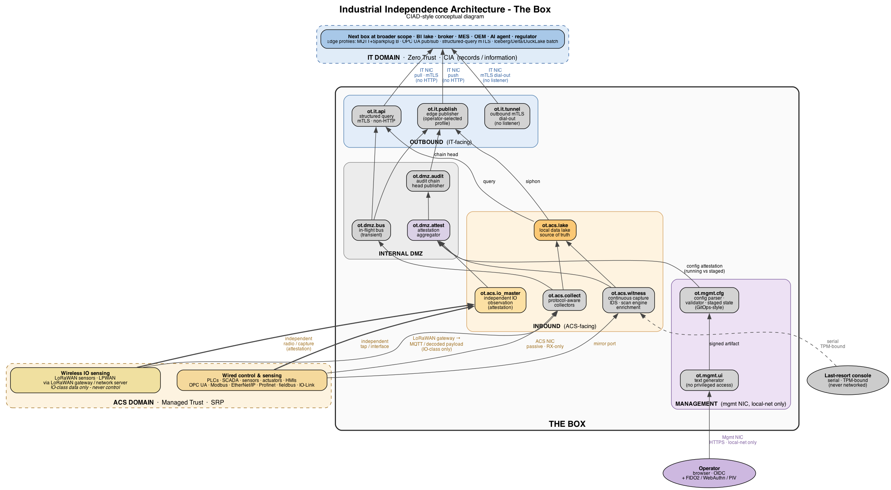
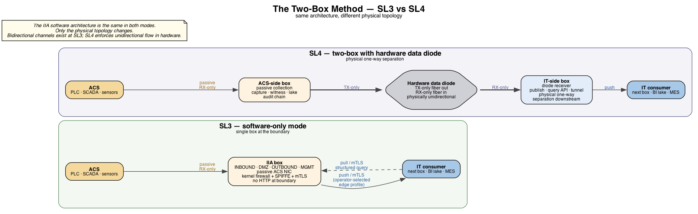
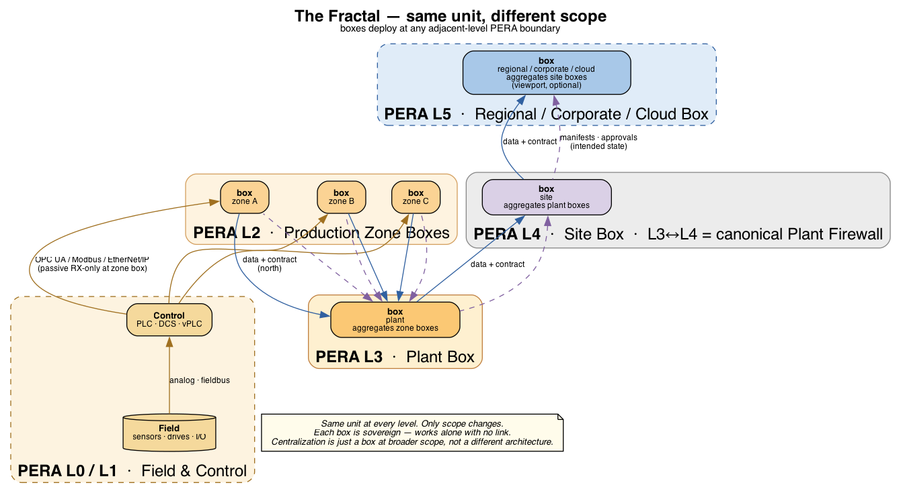

# Internal Architecture

This document describes what runs inside an IIA box: the role inventory, the partitioning, the boundary invariants, the workload identity model, the audit posture, the deployment modes that map to IEC 62443 security levels, and the candidate implementations operators might select.

The architecture spec names **roles** and the **contracts** they satisfy. It does not name products. Operators select implementations to fit their operational requirements (license posture, resource envelope, vendor relationships, audit evidence). The non-normative *Reference Implementations* appendix at the end lists candidate software per role.

For the architectural principle this document implements, see the project [README](../README.md). For the two-box deployment that reaches Security Level 4, see [The Two-Box Method](../README.md#the-two-box-method) in the same.

Worked examples of contracts in operator-deployed catalogs are at [`sample-contracts.md`](sample-contracts.md) — internal / boundary / device / inbound scopes with concrete YAML.

CIAD-style diagrams (rendered from Graphviz `.dot` sources alongside):

- The box and its external surfaces — [`box-architecture.png`](box-architecture.png) (source: [`box-architecture.dot`](box-architecture.dot))
- The Two-Box Method, SL3 vs SL4 — [`two-box-method.png`](two-box-method.png) (source: [`two-box-method.dot`](two-box-method.dot))
- The Fractal — same unit at every PERA scope — [`fractal.png`](fractal.png) (source: [`fractal.dot`](fractal.dot))







## Invariants

These are the hard architecture rules. Implementation choices must respect all of them.

1. **No HTTP at the box's external boundary, in either direction, at runtime.** No HTTP listener on the ACS or IT NICs. No outbound HTTP/HTTPS from any component — no registry pulls, no rule-feed updates, no telemetry, no CRL/OCSP. Updates and deltas come via signed bundles in OS updates or mTLS-tunneled deltas pulled by the box's outbound channels. The optional local management UI on the management NIC is the only HTTPS listener anywhere in the architecture, and it is local-network only.
2. **Minimum runtime surface.** Every listener, daemon, and outbound connection exists because it was designed and engineered for a specific operational purpose. There is no default-on service. There is no convenience listener. There is no runtime debug interface. The OS image is built so disabled services cannot be turned on at runtime — only by rebuilding the image.
3. **ACS-facing interface is passive.** No IP stack TX, no listeners ever, on the ACS NIC.
4. **All inter-zone traffic transits the internal DMZ.** Inbound zones cannot conduit directly to outbound zones.
5. **Roles, not products.** This document names the role each component fills. Specific software belongs in the *Reference Implementations* appendix, never in the normative sections.
6. **Standards and protocols stay named.** Interface contracts (MQTT, Sparkplug B, OPC UA, Zenoh, CESMII i3X, MCP, OIDC, FIDO2, SPIFFE SVID, OCI image format, TPM 2.0, UEFI Secure Boot, TLS 1.3, IEC 62443, ISA-95, PERA+) belong in the spec because they are interoperability surface.
7. **Every communication is contracted.** Inter-container, inter-zone, cross-side, and external — every conduit, every mTLS pairing, every device exchange must be backed by an explicit data contract in the deployment's contract catalog. Communication without a contract is **prevented** where the architecture can enforce it (kernel firewall + workload identity + admission control + mTLS cooperate to refuse uncontracted traffic; SDN policy strengthens this on the network fabric where deployed), and **flagged** where prevention is not possible (passive observation on the ACS NIC, broadcast). Contractlessness is a deployment defect.
8. **Attestation observes prevention.** Every prevention mechanism may leak. The architecture assumes this. Independent attestation observers (network IDS for the policy plane, IO master for the physical substrate) cross-check what actually happened against what the contract catalog said should happen, and emit attestation flags when they diverge. **The network IDS attestation observer is required regardless of whether SDN is deployed; in non-SDN deployments it is the only network-plane attestation, and it must be able to alert.**
9. **Configuration is a signed artifact, not a live API.** The box accepts configuration as a signed text document consumed by a constrained-grammar parser, never as a REST endpoint that mutates running state. Image admission, OS updates, and configuration are the same pattern: artifact-in, verify, validate, apply-or-reject. The box has no live mutation channels. The management UI is a text generator with no privileged access; the parser is the trust boundary for configuration the way container-runtime admission is the trust boundary for workloads.

## Alignment with PERA+

The architecture aligns with PERA+ (pera.net, Gary Rathwell, Entercon, CC BY-SA 4.0). Specifically:

- **The 4Rs** — Response, Resolution, Reliability, Resilience — determine which functions belong on the box (high-resolution, low-latency, high-reliability) and which belong at broader scope (downsampled, latency-tolerant, lower-reliability acceptable).
- **"Secure interfaces, not integration."** The box is an interface between ACS and IT, not a merger of the two. PERA's framing applied directly.
- **Zero Trust ↔ Managed Trust transition.** The box terminates the IT-side Zero Trust environment and begins the ACS-side Managed Trust environment.
- **L3/L4 canonical placement.** The box's archetypal scope is the PERA L3/L4 boundary (Plant Firewall placement). The architecture deploys at any adjacent-level boundary; only scope changes.
- **CIAD and CIND diagram conventions** are used for IIA reference deployments. CIAD for conceptual block diagrams during Conceptual Engineering; CIND for network detail with SL1–SL4 annotations during Preliminary Engineering.

## Physical Realizations

The architecture is logical. "The box" is a role-aggregate at a zone boundary, realizable at any scale the operator's scope demands:

- **Commodity-hardware appliance** (the small-shop realization). Single chassis. Sized to the workload of the zone.
- **Multi-host stack.** Broker on its own machine, capture and lake on another, IDS on another. Useful at plant or site scope.
- **Virtualized infrastructure.** Same logical zones realized as VMs across hypervisor hosts.
- **Kubernetes cluster** (k3s through full k8s). Reasonable at site, regional, or corporate scope where the control-plane overhead is justified.
- **Hyperscale data-center deployment.** Same architecture realized across a fleet, for regional or corporate-scope role-aggregates.

The invariants travel across realizations: no HTTP at the external boundary, minimum runtime surface, ACS-facing passive, all cross-side traffic via DMZ, mTLS at every internal hop, audit chain integrity. The hardware envelope and the orchestrator choice are realization concerns.

The commodity-hardware appliance is positioned the way it is because IIA's accessibility for the underserved triangle depends on it running on inexpensive hardware. The architecture itself does not require it. Same principle for a single SCADA site as for a regional data-center management deployment.

## Security Level Targets

| Mode | SL Target | Topology |
|---|---|---|
| Software-only | SL3 | Single IIA box at the cell boundary. ACS-facing NIC passive. Internal three-side partitioning (inbound / DMZ / outbound) with default-deny conduits, mTLS at every internal hop. Push-only outbound on operator-selected edge profile, structured query API on mTLS for pull. No HTTP at the boundary. |
| Two-box + diode | SL4 | One IIA box ACS-side, hardware data diode, one IIA box IT-side, physical one-way separation from the external consumer. Same software, same configuration model. |

SL3 does not promise unidirectional flow. SL3 promises a hardened, segmented, authenticated, audited boundary. Bidirectional channels exist at SL3 (the structured query API listener on the IT NIC, the outbound mTLS tunnel reverse-dial) — they are firewalled, identified, and recorded.

SL4 is reachable only with hardware diode and physical separation. No software-only deployment claims SL4. Anyone who claims otherwise is wrong.

SL1 and SL2 are not separate products. They are SL3 with controls relaxed by deployment policy. The architecture does not change.

## Hardware Capabilities

The architecture binds to a small set of hardware capabilities, not to specific sizing. Sizing is application- and scale-dependent and varies across realizations.

| Capability | Requirement | Notes |
|---|---|---|
| Trust anchor | TPM 2.0 with UEFI Secure Boot, measured boot, and PCR-sealed secrets | Mandatory at SL3. |
| Hardware crypto acceleration | x86_64 AES-NI, ARMv8 cryptographic extensions, or equivalent | mTLS at every internal hop. |
| Storage | Self-encrypting drive (SED) or full-disk encryption with hardware-trust-anchor-sealed key | |
| Network | **3 physical NICs ideal — ACS / IT / Management.** **2 NICs + VLAN acceptable on commodity hardware** (ACS physical, IT and Management VLAN-separated on the second NIC with strict ingress filtering). | Two-box mode requires fiber TX-only on the ACS-side box and fiber RX-only on the IT-side box, paired with the hardware diode. |

The 3-NIC physical topology is preferred because it provides hard physical separation between the data plane (IT) and the local management plane. The 2-NIC + VLAN variant accepts a software-only separation between IT and Management for cost reasons; this is supported but requires disciplined VLAN configuration, source-IP filtering, and auditable evidence of both.

## External Surfaces

The box has, at most, three external network interfaces plus a console:

| Interface | Listeners | Outbound | Notes |
|---|---|---|---|
| ACS NIC | none, ever | none | Passive capture only. RX-only at the kernel level. |
| IT NIC | structured query API on mTLS only (non-HTTP transport — operator-selected) | edge publisher (push, operator-selected profile), outbound mTLS tunnel agent, signed-bundle pull on mTLS for rule/CRL deltas | Where the data plane lives. **No HTTP/HTTPS listener, ever.** |
| Management NIC | local UI (HTTPS, OIDC + 2FA, identical auth model to remote-access broker), on only when operator enables it | none | Local-network only. Source-IP-restricted. Not routed to WAN. |
| Console | TPM-bound serial, last-resort | none | No network listener, ever. |

## Internal Partitioning

The box is internally three-partitioned plus a management interface. Each partition is a kernel-firewalled zone with explicit conduit policy.

The term "DMZ" in "internal DMZ" refers to the box's middle partition, not the conventional IT-OT DMZ at PERA L3.5. The conventional DMZ separates IT-touching-control from IT-not-touching-control under unified IT governance; IIA's internal DMZ separates inbound capture from outbound publishing across the SRP / CIA boundary, inside one operator-owned unit.

```
+---------------------------------------------------------------+
|                            BOX                                |
|                                                               |
|  INBOUND (ACS-FACING)        DMZ           OUTBOUND (IT)      |
|                                                               |
|  ot.acs.collect ─┐                                            |
|  ot.acs.witness ─┤                                            |
|                  ├──► ot.dmz.bus ────┬──► ot.it.publish ────► (edge profile north)
|                  │   (transient)    │                         |
|  ot.acs.lake ◄───┘                  ├──► ot.it.api ─────────► (structured query, mTLS)
|  (durable, source                    │                        |
|   of truth)                          └──► ot.it.tunnel ─────► (mTLS dial-out, broker)
|                                                               |
|                       ot.dmz.audit ──► (chain head north)     |
|                                                               |
|  Management:  ot.mgmt.ui (management NIC only, on-demand)     |
+---------------------------------------------------------------+
```

**Zones:**

| Zone | Purpose | Side | Inbound conduits | Outbound conduits |
|---|---|---|---|---|
| `ot.acs.collect` | Protocol-aware collectors for horizontal (controller↔controller) and vertical (controller↔IO) network traffic — OPC UA, EtherNet/IP, Profinet, Modbus (TCP and RTU), MQTT-SN, fieldbus. Device-level digital interfaces (IO-Link, HART) are observed at the substrate by `ot.acs.io_master`, not at the network by collectors. LoRaWAN / LPWAN ingest via on-box radio or external LoRaWAN gateway publishing MQTT (IO-class data only — never control). | Inbound | ACS NIC (passive); on-box LoRaWAN radio if equipped | `ot.dmz.bus`, `ot.acs.lake` |
| `ot.acs.witness` | Continuous capture, network IDS (signature + contract-attestation observer), scan engine, enrichment | Inbound | ACS NIC (passive, mirror port) | `ot.acs.lake`, `ot.dmz.audit`, `ot.dmz.attest` |
| `ot.acs.io_master` | Independent IO substrate observation (IO and industrial Ethernet); cross-checks primary capture | Inbound | Independent NIC tap / IO interface (separate from `ot.acs.collect`) | `ot.dmz.attest` |
| `ot.acs.lake` | Local data lake — durable, append-only, source of truth | Inbound | `ot.acs.collect`, `ot.acs.witness`, `ot.dmz.bus` | `ot.it.publish` (siphon), `ot.it.api` (read), `ot.dmz.audit` |
| `ot.dmz.bus` | In-flight message bus; transient, no durable raw data | DMZ | `ot.acs.*`, `ot.it.*` | `ot.acs.lake` (write-through), `ot.it.publish`, `ot.it.api` |
| `ot.dmz.audit` | Audit chain head publisher (full chain on inbound side) | DMZ | All zones (write) | `ot.it.publish` (north replication) |
| `ot.dmz.attest` | Attestation aggregator and SDN-policy / catalog correlator; emits `ot.attestation.*` | DMZ | `ot.acs.witness`, `ot.acs.io_master`, SDN controller, SPIFFE issuer | `ot.acs.lake`, `ot.dmz.audit`, `ot.it.publish` |
| `ot.it.publish` | Edge publisher; reads lake, pushes on configured profile | Outbound | `ot.acs.lake`, `ot.dmz.bus`, `ot.dmz.audit` | IT NIC |
| `ot.it.api` | Structured query API; mTLS, non-HTTP | Outbound | `ot.acs.lake`, `ot.dmz.bus` | IT NIC |
| `ot.it.tunnel` | Outbound mTLS tunnel agent for the remote-access broker | Outbound | (none — initiates only) | IT NIC (dial-out only) |
| `ot.mgmt.ui` | Local management UI — **text generator only**, produces candidate configuration artifacts. No privileged access. | Management | Management NIC (operator browsers, source-IP-restricted) | `ot.acs.lake` (read-only), `ot.it.api` (read-only), `ot.mgmt.cfg` (artifact submission) |
| `ot.mgmt.cfg` | Configuration parser, validator, staged-state holder, configuration attestation observer | Management | `ot.mgmt.ui` (artifact submission), outbound update channel (artifact pull) | Privileged applier (on-demand, gated), `ot.dmz.audit`, `ot.dmz.attest` |

**Conduit policy.** Inter-zone traffic is enforced by host-layer mechanisms in order, with an optional SDN layer where the operator has deployed it:

1. **(Optional) SDN policy plane** — programmable network policy compiled from the contract catalog where the operator has deployed SDN. Conduits exist on the fabric only where the catalog authorizes them.
2. **Per-zone container networks** — separate bridges per zone; no direct routing between bridges.
3. **Kernel firewall** — allowlist conduits between bridges by source zone, destination zone, port. Default policy: drop.
4. **mTLS at the application layer** — every inter-zone connection authenticates both ends via SPIFFE IDs (see *Workload Identity*).

A connection that fails any active layer is rejected and logged to the audit chain. The attestation observer (`ot.dmz.attest`) cross-correlates events from all active layers and emits `ot.attestation.policy_drift` when they disagree. Non-SDN deployments have three layers; the IDS attestation observer compensates by being the only network-plane observer and must be able to alert.

**Cross-side enforcement.** Inbound zones (`ot.acs.*`) and outbound zones (`ot.it.*`) cannot conduit to each other directly. All cross-side traffic transits a DMZ zone (`ot.dmz.bus`, `ot.dmz.audit`). This is the structural property that makes the boundary auditable — every inbound→outbound message exists as a DMZ event.

## Data Plane

**The local data lake is the source of truth.** All inbound capture, classification output, audit, events, and time-series land in `ot.acs.lake`. The lake is durable, append-only, and the only place raw data persists on the box. Outbound publishers siphon from the lake.

**The in-flight bus (`ot.dmz.bus`) is transient.** It exists for low-latency event delivery between zones. It does not retain durable data. Subscribers tail it for live events; consumers expecting historical state read from the lake.

**High fidelity at the edge, downsampled centrally.** The lake stores at native resolution (subsecond, full PCAP segments). Broader-scope BI lakes downstream (open table format on object storage — fed by `ot.it.publish` when the operator selects that profile) hold downsampled, modeled data for analytics. Full-fidelity slices are pulled on demand from the on-box lake via the structured query API.

**Schema is observed, not enforced, at the edge.** The box publishes typed-but-flexible records. Schema modeling, knowledge-graph audit, microservices observation over broker payloads, and ISA-95 conformance happen at broader scope — by design. Type-safety is the platform's job, not the publisher's. Sequence numbers and service IDs are emitted alongside every record so downstream observability can stitch traces without negotiating with the edge.

**Data contracts are the integration unit at the L2↔L3 boundary.** Contracts specify what data the box exposes, which triggers fire, what fault codes are emitted, and what return semantics apply. Contracts are versioned; the architecture treats contract evolution as a first-class concern, not an afterthought. Operators define contracts per deployment; the architecture does not pick.

## Outbound Edge Profile

The edge profile is **operator-selectable per deployment**. The architecture is profile-agnostic. Candidate profiles, with notes on where each fits:

| Profile | Where it fits | Notes |
|---|---|---|
| MQTT + Sparkplug B | Controller↔area-broker (PERA L1/L2) | Field-validated at this scope. Above L2/L3 the rebirth-storm and QoS pathologies become liabilities; do not use as a default at higher levels. |
| OPC UA pub/sub | Cell↔site, site↔enterprise | ACS-native, deterministic message ordering, schema-aware. |
| Zenoh pub/sub + queryables | Any scope; especially appliance ↔ broader-scope mesh | Single protocol covers pub/sub, queryable, and federated routing across boxes. No rebirth pathology. Fits when the operator wants to collapse multiple roles onto one protocol. |
| **CESMII i3X (preferred query interface at L2↔L3)** | Pull-mode consumers, on-demand high-fidelity | The box always exposes a structured query API; **i3X is the preferred standard** for L2/L3 industrial data query, with OpenAPI under the hood. v1 is time-series + static-state; transactional / method semantics are punted to v2 — use a separate transactional channel for MES/MOM. |
| Structured query API on mTLS (general) | Pull-mode consumers when i3X is not selected | gRPC, NATS req/reply, OPC UA req/reply, Zenoh queryables, MCP-over-mTLS. Operator-selected. |
| Iceberg / Delta / DuckLake batch write to object store | BI / analytics consumers at broader scope | Versioned, downsampled. Separate from the real-time pipeline. |

The operator picks one or more profiles per deployment. The architecture does not specify a default.

**AI-agent consumption pathway.** When the deployment needs AI-agent access to box data, the path is: box exposes a structured query API speaking **CESMII i3X** over mTLS; an **MCP server** (Model Context Protocol) runs at broader scope on a broker box, pulls from i3X, and exposes the data as MCP tools / resources to AI agents. The MCP server lives off-box because MCP's canonical Streamable HTTP transport conflicts with the box's no-HTTP-at-boundary rule; the box's role is to publish a clean i3X surface that any MCP server can consume. This is the *connect-first → model-second → AI-third* pattern from the field consensus made concrete: i3X is the connection layer; the consumer's modeling and AI agency live one or more scopes up.

For single-box deployments where there is no broker box at broader scope, the MCP server typically runs on the **operator's workstation or a small adjunct host on the local network**. The architecture invariants are unchanged — it is still off-box and still consumes i3X over mTLS. See [`mcp-single-box.md`](mcp-single-box.md) for the operator-facing quickstart.

**Orchestrate transactions, choreograph telemetry.** Telemetry flows (time-series, events, asset state changes) are *choreographed* — fire-and-forget on the edge profile, no acknowledgment expected at the publisher. Transactional flows (MES/MOM operations, work-order acks, recipe downloads) are *orchestrated* — synchronous, acknowledged, traceable end-to-end. The box's edge publisher handles telemetry. Transactional flows go through the structured query API or a dedicated transactional channel; mixing the two in one pipeline is a recurring failure mode.

## Data Contracts

**Every communication on the box and across its boundaries is governed by an explicit data contract.** This is universal — inter-container exchanges within a zone, inter-zone conduits across partitions, cross-side traffic at the internal DMZ, external traffic at the box's boundary, and device-level exchanges with PLCs, sensors, actuators, and HMIs. Communication without a contract is prevented or flagged; either is a deployment defect to reconcile.

Defensibility is the reason. When a system asks "did this happen, and was it allowed?" the answer must trace to a contract. When a communication occurs that is not described by a contract, that is itself an event — observable, attributable, and evidence of an unreconciled deviation.

### The contract catalog

The deployment's full set of contracts is the **contract catalog**, a versioned artifact accessible via the structured query API at a well-known endpoint. Every conduit referenced by the kernel firewall, every mTLS pairing brokered by the workload identity issuer, every external endpoint, every device exchange must be backed by a catalog entry. The catalog is operator-published, and the architecture requires that it be machine-readable, version-controlled, and discoverable.

### Enforcement: prevention, flagging, attestation

Three modes operate together. All three are required.

**Prevention** is the default for all box-internal traffic and all explicitly-allowed external paths. The required layers compile from the contract catalog as a single source of truth:

- **Kernel firewall** — per-zone allowlist conduits enforcing the catalog at the host. Default policy: drop.
- **Workload identity issuer (SPIFFE)** — SVIDs are only issued for workloads with contract entries. No contract → no SVID.
- **Container-runtime admission** — refuses to start workloads without a contract entry and image-signature verification.
- **mTLS** — every inter-zone connection authenticates both ends; an unauthenticated peer is refused.

An **SDN policy plane** is a recommended additional layer where the operator has it: software-defined network policy compiled from the same catalog and enforced on the fabric, so uncontracted flows have no path on the wire before reaching a host. SDN strengthens prevention but is not required by the architecture. **Non-SDN deployments are fine** — they rely on the four required host-layer mechanisms above plus the IDS attestation observer (see *Attestation*) to catch what host-layer prevention misses.

A workload attempting to communicate without a contract is blocked at multiple layers — by SDN (where deployed) before traffic reaches the host, by kernel firewall, by SPIFFE if firewall is bypassed, by mTLS if SVID is forged. Each active layer emits an event when it acts.

**Flagging** is the fallback for paths the architecture observes but cannot pre-empt — passive collection on the ACS NIC, broadcast traffic on the local network, legacy protocols that cannot authenticate. The continuous-capture pipeline records every observed exchange and consults the contract catalog; uncontracted exchanges are emitted as `ot.contract.violation` events.

**Attestation** is the independent-observation layer that catches what prevention misses. See the *Attestation* section below.

The default posture is prevention. Flagging is a concession to physics. Attestation is the assumption-of-leakage made operational.

### Internal contracts (intra-box)

Internal contracts govern communication between containers and zones within a single box. They are simpler than boundary contracts — both ends are operator-controlled, the trust model is uniform, the failure modes are bounded. Each internal contract specifies:

| Field | What it specifies |
|---|---|
| Source workload | SPIFFE ID of the publishing or initiating workload. |
| Destination workload | SPIFFE ID of the receiving workload. |
| Allowed operations | Message types, RPC methods, query patterns. Not "any TCP." |
| Transport | mTLS over a specific bus topic, gRPC method, lake read/write path. |
| Cardinality | One-to-one, fan-out, fan-in, broadcast. |
| Failure semantics | Drop, retry with bounded backoff, fail-closed, fail-open with alarm. |

The kernel firewall conduits, the SPIFFE-based mTLS broker, and the bus subscription policy enforce internal contracts. An attempted connection between workloads not described by a catalog entry is dropped at the firewall and logged as `ot.contract.violation` with source and destination identities, attempted operation, and timestamp.

### Boundary contracts (cross-domain)

Boundary contracts govern every connection that exits the ACS — to enterprise IT, BI lake, broker box at broader scope, MES, OEM consumer, AI agent, regulator-facing dashboard, or any other external consumer. Boundary contracts are **bilateral**: both sides commit; both sides are accountable; both sides are observable. The architecture specifies the shape; operators publish deployment-specific values as a discoverable, versioned artifact alongside the structured query API.

#### ACS-side obligations (what the box commits to producing)

| Dimension | What the box commits to |
|---|---|
| Data inventory | Records the box exposes — namespaces, identifiers, types. Loose schema; observation-friendly. |
| Edge profiles and endpoints | Which profile(s) carry which records (MQTT+Sparkplug B / OPC UA pub/sub / structured query on mTLS / batch BI feed). Endpoints, identities, transport semantics per profile. |
| Freshness and resolution | Native resolution on the box (typically subsecond). What is downsampled before publication. What the consumer can pull at full fidelity from the on-box lake via the structured query API. |
| Retention | On-box retention floor (30 days, matching the disconnected-operation buffer). Aging behavior. How the consumer compensates for gaps. |
| Order and sequencing | Records carry sequence numbers and service IDs. Box guarantees monotonic sequence per service; cross-service ordering is the consumer's problem. |
| Delivery semantics | Per profile. Telemetry (choreographed): fire-and-forget at-most-once on the wire, at-least-once at the on-box lake. Transactional (orchestrated): at-least-once with deduplication via service ID; consumer dedupes. |
| Reconnect and gap behavior | During disconnected operation the box buffers locally and replays on reconnect. Consumer detects gaps via sequence-number discontinuity; box exposes a watermark on the structured query API. |
| Contract version and evolution | Every contract is versioned. Schema changes are additive within a major version; breaking changes require a major-version bump, deprecation period, and overlap window. |
| Authentication and authorization | Box authorizes consumers by SPIFFE-format identity over mTLS. Box's own credentials rotate on a documented cadence. |
| Audit binding | Consumer can fetch the audit chain head and verify it independently. When operator enables audit binding, records carry signed checkpoints traceable to the chain. |
| Quota and fair use | Per-profile rate limits and payload caps, where applicable. |

#### Upstream obligations (what the consumer commits to providing)

| Dimension | What the consumer commits to |
|---|---|
| Connectivity | Bandwidth, latency, uptime, redundancy, routing path. Stated in concrete numbers, not adjectives. |
| Authentication | Credential issuance, rotation cadence, key custody, identity continuity across operator changes. |
| Acknowledgment | Ack semantics where the profile requires them (transactional flows, audit chain head signing). Time bounds on ack. |
| Query response | For pull-mode interactions, the consumer's response window when the box queries the consumer (health check, contract negotiation, watermark request). |
| Schema accommodation | Consumer accepts loose schema and observes; does not enforce at the boundary. Modeling lives at consumer scope. |
| Incident response | Named on-call path, response time, escalation route. Not "we'll get to it" — a clock starts. |
| Capacity and quota | Consumer commits to absorbing the agreed throughput. If the consumer cannot keep up, that is the consumer's failure mode, not the box's. |
| Audit verification | Consumer commits to validating the audit chain head it receives, on the cadence specified. Failure to validate is a contract violation visible to ACS. |

#### RACI matrix

For each named failure mode the contract specifies who from each side is **R**esponsible (does the work), **A**ccountable (single role on the hook), **C**onsulted (weighs in), and **I**nformed (told what happened). A skeleton — operators populate per deployment:

| Event | ACS Responsible | ACS Accountable | Upstream Responsible | Upstream Accountable | Consulted | Informed |
|---|---|---|---|---|---|---|
| Connectivity loss | | | | | | |
| Box outage | | | | | | |
| Schema/version mismatch | | | | | | |
| Authentication failure / cert expiry | | | | | | |
| Audit chain mismatch | | | | | | |
| Rate limit exceeded | | | | | | |
| Contract evolution / deprecation | | | | | | |
| Consumer-side capacity exhaustion | | | | | | |
| Suspected data integrity event | | | | | | |
| Compliance / regulator request | | | | | | |

The architecture requires the matrix to exist, to be specific (named roles, not "the IT team"), and to be reachable by the box for incident-time decision support (e.g., the box can surface "the on-call accountable for this event is X, contact path is Y" via the structured query API).

### Adherence telemetry

The box catalogs and emits its own observations of contract performance — for both internal and boundary contracts. This data class is the authoritative record of who held up which side, and of every uncontracted communication observed. It is published under `ot.contract.*` and lands in the local lake alongside operational data and the audit chain.

| Telemetry stream | What it records |
|---|---|
| `ot.contract.violation` | Any communication attempt without a corresponding catalog entry — internal (workload-to-workload firewall drops) or external (uncontracted external session). Includes source, destination, attempted operation, timestamp. |
| `ot.contract.connectivity` | Upstream uptime, downtime, latency distribution, throughput, route changes. |
| `ot.contract.delivery` | Per-profile messages sent, acknowledged, retransmitted, dropped, rejected. |
| `ot.contract.auth` | Cert expiry warnings, rotation events, failed authentication attempts (internal mTLS and external). |
| `ot.contract.schema` | Consumer attempted to use deprecated version, schema mismatch detected, contract version pulled by consumer. |
| `ot.contract.quota` | Rate limit hit, payload size exceeded, fair-use violations. |
| `ot.contract.reconciliation` | Sequence-number gaps observed by consumer, watermark queries, replay requests. |
| `ot.contract.audit_verify` | Consumer-side audit chain head validation events; failures here are bilateral (either consumer didn't validate, or chain didn't validate). |
| `ot.contract.sla_breach` | Any of the above that crossed an SLA threshold defined in the contract. |

When a counterparty fails to perform, the ACS produces concrete evidence: *"we sent N records on profile X at rate R between timestamps T1 and T2; consumer acknowledged N−K; here is the per-record log; the SLA threshold for ack latency is 500 ms and the observed p99 was 4.2 s."* Adherence telemetry exists so ACS is never the side without receipts.

### Discoverability and ownership

The contract catalog and every entry within it are **published, not implicit**. A consumer must be able to fetch any contract before subscribing or querying. Catalog publication is itself part of the structured query API — a well-known endpoint that returns the current and previous catalog versions, the per-contract RACI matrices, and the SLA thresholds against which adherence is measured.

The contract is the **operator's commitment**, not the architecture's. IIA specifies that contracts exist, that the catalog is universal, that boundary contracts are bilateral and discoverable, and that adherence is recorded. The values are operator policy.

## Attestation

Every prevention mechanism may leak. SDN policy may drift from the contract catalog. Firewall rules may be misconfigured. mTLS sessions may be misissued. Image-admission may be bypassed by a sufficiently-capable adversary. The contract layer assumes none of these failure modes are inconceivable — and runs **independent observation** in parallel to validate that prevention is actually working.

Attestation is not a replacement for prevention. It is the architecture's answer to *"how do you know prevention is actually working?"* When attestation and prevention agree, the operator has evidence of policy compliance. When they disagree, the operator has evidence of policy leakage.

### Network attestation (IDS as policy-leak observer)

The network IDS in `ot.acs.witness` runs two roles, not one:

- **Signature-based threat detection** — the conventional IDS function. Flags known attack patterns observed on the mirrored ACS-side traffic.
- **Contract attestation observer** — independently observes traffic on every internal and external link, compares observed flows against the contract catalog and the SDN policy compilation, and emits attestation flags when reality and policy diverge.

The IDS attestation observer flags:

- Traffic that no contract authorizes (in SDN deployments, the policy plane should have dropped this; in non-SDN deployments, the host-layer prevention should have refused the session — either way, attestation caught it).
- Expected traffic that does not appear within an SLA window (a contract said this should flow — it didn't).
- mTLS sessions that terminate or fail outside the contract's tolerance.
- SDN policy compilation drift, where SDN is deployed — the policy actually loaded on the fabric does not match the policy derived from the current catalog.
- Identity issuance events without a corresponding catalog entry — SVID issued for an unknown workload.

The IDS observer is independent of the SDN policy plane; the policy plane and the observer are derived from the same catalog but enforced/observed by different mechanisms. A leak in one does not silence the other.

**In non-SDN deployments, the IDS attestation observer is the only network-plane evidence of contract compliance.** It must be able to alert — without that capability the architecture has no observability into whether non-host-layer leakage is occurring, and the deployment loses its standing answer to *"how do we know prevention is actually working at the network level?"*

### IO attestation (redundant IO master)

An **IO master** runs an independent observation channel for the physical substrate. It maintains its own readings of the IO surface — analog values (4-20 mA, thermocouple, RTD, voltage), digital IO, device-level digital interfaces (IO-Link, HART — point-to-point links to a sensor or actuator, not networks), fieldbus traffic (Modbus RTU, Profibus), and industrial Ethernet (EtherNet/IP, Profinet, Modbus TCP, EtherCAT) — and cross-checks against what the box's primary observation pipeline reports.

The IO master is independently authenticated (its own SPIFFE identity, its own attestation key) and runs in its own zone. Its observations land in the audit chain with their own signature, distinct from the primary capture pipeline.

Discrepancies between the IO master's reading and the box's reading indicate **substrate-level deviation**: a tampered wire, a man-in-the-middle on the fieldbus, a misreporting device, a frame dropped or modified on the wire, a clock skew exceeding contract tolerance, a value scaled differently than the contract specifies. The IO master emits attestation flags when readings diverge beyond contract-specified tolerance.

When the box's data and the IO master's data agree, the operator has evidence that what was reported was on the wire. When they disagree, the operator has evidence of substrate compromise — at the wire, at the device, or in one of the two observation pipelines. Either is consequential.

The IO master is a **role**, not a product. It can be realized as a separate process on the box with its own NIC tap or IO interface, a separate hardware module (USB-attached, embedded), or a separate physical unit feeding into the box. Multi-host realizations may run the IO master on dedicated hardware. The architecture requires the master's observation path to be **independent** of the primary capture path; sharing a NIC, a switch port, or a software stack would defeat the attestation.

### The attestation data class

All attestation findings are emitted under `ot.attestation.*` and route to the same audit chain as security events:

| Stream | Observer | What it records |
|---|---|---|
| `ot.attestation.network` | IDS attestation observer | Contract violations observed on the network plane that did not match the catalog or SDN compilation. |
| `ot.attestation.io` | IO master | IO substrate reading discrepancies between IO master and primary capture, beyond contract tolerance. |
| `ot.attestation.policy_drift` | SDN controller + catalog correlator | SDN policy actually loaded vs catalog-derived policy expected. Firewall rule mismatch with policy compilation. Admission policy mismatch with image trust root. |
| `ot.attestation.identity` | SPIFFE issuer + correlator | SVID issuance events vs contract catalog entries. Identity continuity across rotation. Unknown-identity sessions. |
| `ot.attestation.audit_chain` | Audit chain verifier | On-box audit chain integrity vs replicated chain head at broker. Detects on-box tampering from any peer that has seen a prior head. |
| `ot.attestation.config` | Configuration attestation observer | Running state vs staged configuration artifact. Confirmation events when convergent; divergence events with delta when not (applier bug, partial-apply failure, or out-of-band mutation). |
| `ot.attestation.image` | TPM-bound image attester | TPM-attested running OS-image hash vs intended hash declared by the upstream manager. Bound to measured boot — measurement tampering breaks the TPM signature. Closes the post-update reconciliation loop. |

An attestation flag is the architecture's standing answer to whether prevention is actually working. The architecture treats attestation findings with the same severity as signature-based threat detections — they are not "informational logs," they are policy-failure evidence.

## Workload Identity

**Role: workload identity issuer producing SPIFFE-format SVIDs bound to attestation evidence.**

Each container has a SPIFFE ID of the form `spiffe://iia.local/zone/<zone>/workload/<name>`. SVIDs are short-lived (1 hour or less) and issued via the SPIFFE Workload API. Identity is bound to the workload's TPM-attested image hash via the issuer's node attestor. A workload that boots from an unsigned image cannot get an SVID and cannot speak mTLS to any peer.

This implements FR1 (Identification & Authentication Control) at the component layer required by SR 1.2 at SL3.

## Image Provenance

**Role: cryptographic image signature verification at admission.**

All container images are:

1. Built reproducibly from source.
2. Signed at build against a transparency-logged trust root (Sigstore-class infrastructure compliant with the OCI image-signature spec).
3. **Bundled into the appliance OS image at build time.** No registry pulls at runtime, ever.
4. Verified at admission by container-runtime policy that requires a valid signature for every image.

A workload whose image fails signature verification is refused before the supervisor can start the unit. The failure is logged to the audit chain and surfaces as an asset-integrity event.

This implements FR3 (System Integrity) SR 3.4 (mobile code restrictions) and SR 3.1 (communication integrity) at SL3.

## Secrets

**Role: encrypted-at-rest secret store, sealed by hardware trust anchor, short-lived issuance to workloads.**

- Secrets are encrypted with operator-chosen tooling that supports hardware-trust-anchor sealing.
- The unsealing key is sealed against TPM PCR values matching the measured-boot expected state.
- At boot, after Secure Boot and rootfs verification succeed, the TPM unseals the secret store key.
- Workloads receive only the secrets they need, mounted as tmpfs files at startup.

Secrets are never written to durable storage in plaintext. A box that has been physically tampered with (PCR mismatch on next boot) cannot unseal the secret store.

This implements FR4 (Data Confidentiality) SR 4.1 at SL3 and provides a credible path to FR4 SR 4.3 (cryptographic key management) when paired with an external HSM in two-box mode.

## Audit Logging

**Role: hash-chained, append-only, replicated north before deletion is possible.**

- Every security-relevant event (authentication, authorization, container lifecycle, conduit rejection, signature failure, SVID issuance, session open/close) is emitted as a structured record.
- Records flow into `ot.dmz.audit` and are written to an append-only log on the inbound side with a hash chain: each record carries `H(prev_hash || record)`.
- The audit chain head is published every minute via `ot.it.publish` as `ot.security.audit.head`. The next box up signs it and re-publishes north. Tampering with the on-box log is detectable from any box that has seen a prior chain head.
- Retention on-box: 30 days minimum (matches the disconnected-operation buffer). Replication north happens as soon as connectivity exists. Off-box retention is governed by the receiving box's policy.

This implements FR3 SR 3.9 (audit data integrity) at SL3.

## Remote Access

**Role: clientless, browser-mediated remote-access gateway with native session recording, located at broader scope (broker), reached by the box via outbound-only mTLS tunnel.**

```
                                              broker
                                             (another box at
                                              broader scope)

                                            +-----------------+
   +------------------+                     |                 |
   |   IIA box        |  reverse mTLS       | remote-access   |  ◄── operator
   |                  | ◄────────────────►  | gateway         |    (browser, HTTPS)
   |  ot.it.tunnel    |                     | (clientless,    |
   |  (mTLS dial-out, |                     |  session        |
   |   no listener)   |                     |  recording)     |
   |                  |                     |                 |
   |  ot.mgmt.ui      |                     | JIT credential  |
   |  (mgmt NIC only, |                     | broker          |
   |   on-demand)     |                     |                 |
   +------------------+                     | append-only     |
                                            | recording store |
                                            +-----------------+
                                                     │
                                                     ▼
                                          external IdP (OIDC + FIDO2)
```

**Properties:**

- **Zero inbound on the IT NIC.** The tunnel agent in `ot.it.tunnel` dials out to the broker over mTLS. The box exposes no remote-access listener on the IT NIC.
- **The broker is just another box at broader scope.** No new architecture; the fractal holds.
- **Operator authentication at the broker.** External IdP via OIDC, with FIDO2 / WebAuthn / PIV as second factor. The box has no permanent operator accounts.
- **Just-in-time credentials.** Operator authorization at the broker triggers issuance of a short-lived credential for the on-box target. The credential is injected into the remote session and expires at session end.
- **Session recording.** Every session records keystrokes and screen. Recordings are written to an append-only / object-locked store on the broker, replicated to the next box up.
- **Local management UI** runs on the management NIC only, when the operator enables it. Same auth model (OIDC + 2FA) as the broker tunnel path. Source-IP-restricted, never routed to WAN. The local UI is the same role as the remote gateway, with a different topology.

## Local Last-Resort Access

A serial console (RS-232 or USB-serial) is present on every box. It is the only path that requires neither the broker nor the management network. It is used when both are unreachable and the box needs hands-on intervention.

- Console authentication is local with TPM-bound hardware token.
- Every console session is logged to the audit chain via the kernel audit subsystem.
- The console has no network listener. There is no SSH on the IT NIC, ever.

## Updates

**Role: immutable host OS with atomic A/B updates and rollback.**

- The OS image is composed at build, signed against the same transparency-logged trust root as the container images, and published to the operator's distribution channel.
- The box pulls and stages a new deployment but does not activate it until the operator authorizes a reboot.
- The update either fully applies or fully does not. No in-place mutation of the running rootfs.
- A failed boot of the new deployment automatically rolls back to the previous one.

**Container image updates** ride along with OS updates. New container images are bundled into the OS image at build time. There is no live registry pull from the box; the only way a container changes is by an OS update.

This implements FR3 SR 3.4 (deterministic update behavior — the box never enters an in-between state during update) and FR7 SR 7.1 (resource availability).

## Configuration

The box accepts configuration as a **signed text artifact**, never as a live API. The pattern matches image admission and OS updates: artifact-in, verify, validate, apply-or-reject. There is no REST endpoint that mutates running state. The box has no live mutation channels at all.

### Why no configuration API

A configuration API is a live mutation surface. Every endpoint is an authentication decision, an authorization decision, an input validation decision, and a state mutation, all happening in real time under adversarial conditions. The attack surface is the cartesian product of endpoints × auth states × input shapes. That surface is large even when implemented well, and almost nobody implements it well.

A text artifact consumed by a parser collapses the entire surface into two questions: *can the attacker modify the artifact, and can the attacker trick the parser*. Artifact integrity is a solved problem — signatures, hashes, filesystem permissions, TPM-sealed write paths. Parser correctness against a constrained declarative grammar is a much smaller verification surface than "is every endpoint of a 40-endpoint API correctly implemented." A small parser can be formally reasoned about. A REST API cannot.

The deeper property is the air gap between the management UI and the running system. The UI generates text; it has no privileged access. If the UI is compromised, the attacker gets the ability to produce a configuration artifact that still has to survive the signature check, the parser, the validator, and the gated internal call set. The UI never touches the system. The artifact is the interface.

### The configuration artifact

The artifact is a flat declarative document in a **constrained, non-Turing-complete grammar**. If the grammar requires a Turing-complete interpreter, the security property is lost; the architecture requires the grammar be small enough that the parser is auditable. The artifact covers:

- Zone definitions and conduit policy
- Contract catalog entries (internal and boundary)
- Edge profile selection per consumer endpoint
- Workload identity bindings
- IdP and credential references
- Edge publisher / structured query API endpoint configuration
- IDS and scan-engine rule-set bindings
- IO master tolerance thresholds
- Operator trust roots and signing-key references

### Lifecycle

```
edit (off-box) → sign (operator key) → submit → verify → parse → validate → stage → apply
```

1. **Edit.** Operator or operator's tooling (the local management UI is one option, an off-box config repo / Git is another) produces a candidate artifact. The management UI is a text generator only — it cannot apply.
2. **Sign.** The artifact is signed with an operator credential against the configured operator trust root.
3. **Submit.** The artifact arrives via the management interface (`ot.mgmt.ui` → `ot.mgmt.cfg`) or via the same outbound update channel used for OS images (signed-bundle pull on mTLS).
4. **Verify.** Signature checked. Failure → rejection, audit event, no further processing.
5. **Parse.** The constrained-grammar parser in `ot.mgmt.cfg` produces a structured intermediate representation. Parse failure → rejection, audit event.
6. **Validate.** Semantic validation — references resolve, contracts well-formed, identities exist, profiles coherent, conduits do not violate invariants. Validation failure → rejection, audit event.
7. **Stage.** The validated configuration becomes the staged desired state, retained alongside the current applied state.
8. **Apply.** A gated internal call set, executed by a privileged applier activated on demand by the parser, transitions current state to staged. Each internal call is itself audited.

The applier is the only component with privileged access to the box's mutable state. It executes only when a verified, parsed, validated artifact is staged for application. It never executes unrelated requests. It exits when the transition completes.

### Gated internal calls

The narrow set of internal calls the applier makes — load nftables policy, register SPIFFE bindings, update SDN policy where deployed, install IdP credentials, register contract catalog entries, configure edge publisher endpoints — are **first-class audit events**. Each call lands in the hash-chained audit log with: before-state, after-state, the configuration artifact hash that authorized it, the parser's validation result, and the operator identity that signed the artifact.

A forensic investigation can reconstruct exactly which configuration change caused which state transition, signed by whom, at which time, with cryptographic evidence at every step.

### Configuration attestation

A configuration attestation observer cross-checks **running state against the staged configuration artifact**, emitting `ot.attestation.config`:

- Running state matches staged configuration → confirmation event, on a periodic cadence.
- Running state diverges → divergence event with delta. Indicates either an applier bug, a partial-apply failure, or an out-of-band mutation.

Configuration attestation closes the loop on the management plane the same way the IDS contract-attestation observer closes it on the data plane: independent observation, cross-checking running reality against the declared catalog.

### GitOps for an air-gapped industrial appliance

The pattern is GitOps adapted to the constraints of an industrial appliance: declarative configuration is the source of truth, signed artifacts are the propagation mechanism, the parser is the admission boundary, running state converges to declared state, divergence is observable. The box never accepts a mutation that isn't a signed artifact. The management UI never has privileged access. The configuration plane has no live API surface.

## Update Orchestration

The local update lifecycle (above) is half the picture. The other half is how a fleet of boxes — a plant's worth, a site's worth, a region's worth — gets coordinated. The architecture is the same artifact-in pattern at fleet scope, recursed through the fractal.

### What gets updated

Every mutable aspect of the box is a signed artifact:

| Artifact class | What it carries | Cadence |
|---|---|---|
| OS image | Host OS + bundled container images | Slow (weeks / months) |
| Configuration | Zones, conduit policy, contract catalog, edge profiles, identity bindings, IdP refs | Operational (days / weeks) |
| IDS / scan / enrichment rule sets | Detection content | Faster (daily / hourly) |
| Operator trust roots | Signing-key references | Rare |
| Approval artifacts | Operator authorization to apply a staged change | Per-update |

All five flow through the same pipeline: **verify signature → parse / validate → stage → authorize → apply → report**. There is no out-of-band path.

### Distribution: pull, never push

A box never accepts an inbound mutation. Every artifact arrives by box-initiated outbound mTLS pull from its upstream manager (which is just another box at broader scope, or a designated artifact mirror). The pull channel is the same one the box already uses for outbound publishing — no new listener, no new outbound mechanism. No HTTP, in either direction, ever.

The upstream publishes a *manifest* per box (or per zone of boxes): the intended OS-image hash, intended configuration hash, intended rule-set hash, and any approval artifacts that have been issued. The box pulls the manifest on a configured cadence and on connectivity-restore events.

### The fleet is a fractal

```
[corporate / regional box]      manages →   [site boxes]
       ↓                                          ↓
  publishes intended state                 reconcile to declared state
       ↑                                          ↑
  receives reported state                   report current state
                                                  ↓
                                          [plant boxes]
                                                  ↓
                                          [zone boxes]
```

Each box at broader scope acts as the orchestrator for its children. Children pull intended state from their parent and report their actual state back. The orchestrator is not architecturally distinct — it is just another box, with `ot.it.publish` and `ot.it.api` configured to publish and serve fleet-orchestration artifacts to its children.

This means there is no global "update server." The fleet's source of truth lives at whatever scope the operator manages from — and that scope can move (the corporate box manages site boxes; the site box manages plant boxes; the plant box manages zone boxes), with each level only seeing its direct descendants.

### Authorization

Staged updates do not auto-apply. An **approval artifact** — itself signed, itself versioned, itself in the contract catalog — authorizes a specific box to apply a specific staged update within a specific time window. The architecture supports:

- **Per-box approvals** — one operator signs an approval for one box, valid for a window.
- **Per-fleet approvals** — one approval covers a named set of boxes; the box checks its identity against the set.
- **Two-person integrity** — approval artifact requires two distinct operator signatures; either alone is invalid. (FR2 SR 2.4 control.)
- **Time-windowed** — approvals are valid for an operator-defined window (24 h, 1 week, etc.); after which they expire.
- **Maintenance windows** — approvals may be conditionally valid only within a declared window.

The applier refuses to act without a valid, current approval artifact. Verification happens at the same trust root as the update artifact itself.

### Rollout strategy is operator policy

The architecture does not pick a rollout strategy. Operators implement what fits their environment by choosing which boxes get which approvals at which times:

- **Canary** — approve one box; observe attestation for N hours; expand.
- **Percentage** — approve X% of the fleet; observe; approve the rest.
- **Per-zone** — non-critical zones first, safety-critical zones last.
- **Per-plant maintenance window** — approve all of plant A during its window; plant B never affected.
- **Hold for cause** — withhold approval from boxes flagged by attestation, by audit, or by operator review.

Each strategy is encoded in *which approval artifacts get issued, to which boxes, with which time windows*. The architecture provides the substrate; the operator provides the policy.

### Reconciliation

After an update applies, the box reports its current state — running OS-image hash, running configuration hash, running rule-set hashes, attestation results — back to its upstream manager. The manager compares against the intended state it published. Three outcomes:

- **Convergent** — running state matches intended. Box is healthy and up to date.
- **Pending** — staged but not yet applied (no approval, or approval expired). Manager surfaces this so the operator knows what is sitting and waiting.
- **Divergent** — running state does not match intended, despite an apparent application. Manager flags this and the box's `ot.attestation.image` and `ot.attestation.config` will already be emitting divergence events.

A divergent box is not assumed to be healthy. The manager treats it as a candidate for forensic review, not for further updates.

### Disconnected reconciliation

A box may be offline for thirty days (the disconnected-operation buffer). When it reconnects:

1. Box reports the state it has been holding — current running hashes, accumulated audit chain, accumulated `ot.contract.*` and `ot.attestation.*` adherence telemetry — to upstream.
2. Box pulls the current intended state manifest.
3. Box pulls any approval artifacts addressed to it that are still within their validity windows.
4. If staged updates and current approvals exist, the box applies and reports.
5. If approvals have expired, the box waits for fresh approvals; nothing is auto-applied past its expiration.

The result is that a long-disconnected box converges on its intended state when reconnected, **at operator pace**, not whatever rollout was current during its outage.

### Image attestation

After an update applies, the box's TPM-attested image hash is published as `ot.attestation.image` for the manager to verify. The hash is bound to measured boot — if the box reports an image hash that does not match what is actually running (because of measurement tampering), the TPM signature would not verify. Image attestation closes the loop the same way configuration attestation does: prevention applies, attestation observes, divergence is a flag.

| Attestation stream | What it records |
|---|---|
| `ot.attestation.image` | TPM-attested running image hash vs intended image hash declared by upstream. |

### Emergency rollback

Two paths:

- **Remote rollback** — operator issues a *revert approval artifact* identifying the previous image hash as the intended state. The box pulls, verifies, applies. Atomic A/B and rpm-ostree-class rollback semantics make this one reboot.
- **Local last-resort rollback** — via the TPM-bound serial console. Operator authenticates locally, issues a rollback command. Logged to the audit chain. Used when the box is unreachable from the manager (network failure, partial brick, etc.).

A failed boot after applying a staged image automatically rolls back to the previous deployment without operator action. The architecture's worst case for an update is one failed boot followed by automatic restoration.

### Putting it together

To push an update to one box:

1. Build new OS image; sign with operator key against the configured trust root.
2. Publish the image to the upstream manager box's distribution channel.
3. Update the manifest at the manager: intended image hash for box X is now `<new hash>`.
4. Issue a signed approval artifact: box X is authorized to apply `<new hash>`, valid until T+24h.
5. Box X pulls the manifest on its next cycle; sees new intended image; pulls the image; verifies; stages.
6. Box X pulls the approval artifact; verifies; applies the staged image at the next operator-configured window.
7. Box X reboots into the new image; TPM-attested hash published as `ot.attestation.image`.
8. Manager compares reported hash to intended; reconciliation closes; the box is now confirmed convergent.

To push the same update to a fleet, repeat steps 2–8 with approvals issued per the chosen rollout strategy.

## SL3 Foundational Requirements Mapping

| FR | Requirement | Implementation |
|---|---|---|
| FR1 | Identification & Authentication Control | SPIFFE workload identity (component); external IdP + FIDO2 (operator); TPM-bound console (last-resort); no permanent operator accounts on box. |
| FR2 | Use Control | Rootless containers + capability drops; broker RBAC; JIT credentials; supervisor approval workflow for risky actions. |
| FR3 | System Integrity | UEFI Secure Boot + measured boot + PCR-sealed secrets; signed-image admission; hash-chained audit log; atomic A/B updates. |
| FR4 | Data Confidentiality | Full-disk encryption with TPM-sealed key; mTLS between every zone; secret store sealed by TPM; TLS 1.3 minimum on every external conduit. |
| FR5 | Restricted Data Flow | Per-zone container networks; default-deny kernel-firewall conduits; ACS NIC passive; **no HTTP at the boundary in either direction**; all inbound→outbound traffic transits the DMZ; hardware diode in two-box mode. |
| FR6 | Timely Response to Events | Network IDS with current rule sets; audit chain head publishes every minute; alerts as `ot.security.*`; broker-side runbook automation. |
| FR7 | Resource Availability | Per-zone resource limits; supervisor dependency graph; atomic update rollback; 30-day local buffer for disconnected operation; redundant broker at broader scope. |

## SL4 Two-Box Deployment

**Topology:**

```
   ACS-side IIA box ───► hardware data diode ───► IT-side IIA box ───► external consumer
   (passive collection,     (TX-only fiber,           (publishes north,    (with physical
    capture, witness,        RX-only fiber,            no return path        one-way separation)
    lake, audit)             no return path)           to ACS side)
```

**Configuration delta from SL3:**

- ACS-side box: `ot.it.publish` configured to send over a diode-friendly transport (typically UDP with FEC; TCP cannot survive a diode); no inbound conduits on the IT-side NIC; `ot.it.tunnel` and `ot.mgmt.ui` removed (no remote access into the ACS-side box; all operator access lands on the IT-side box).
- IT-side box: `ot.acs.*` zones are empty or minimal (no PLCs to collect from; observation already happened on the ACS side); receives the diode stream into `ot.acs.diode_in`; passes through to `ot.dmz.bus` and `ot.acs.lake`.
- The diode appliance is not part of the IIA software stack; IIA configures itself to operate correctly across one.

The architecture does not change. The same workload definitions, the same partitioning, the same audit chain. Only the network configuration and the absence of a few zones change between the two boxes.

## Reference Implementations (non-normative)

This section lists candidate software for each role. **None of these are part of the architecture spec.** Operators choose implementations to fit their requirements (license posture, resource envelope, vendor relationships, audit evidence). The architecture survives substitution; the contract catalog makes implementations interoperable.

Some technologies span multiple roles. Zenoh, in particular, can fill *Edge publisher (pub/sub)*, *Structured query API*, *In-flight message bus*, and *Inter-box mesh substrate* (cross-scope routing across the fractal) all on the same protocol. Operators selecting a multi-role implementation can collapse rows; the architecture neither requires nor forbids this. The role inventory is a *minimum* of distinct concerns the deployment must address, not a count of distinct software packages.

| Role | Candidate implementations | Notes |
|---|---|---|
| Immutable host OS (atomic A/B) | Fedora IoT (rpm-ostree), CentOS Stream Image Mode, Ubuntu Core, Talos Linux | |
| Process supervisor | systemd, runit, OpenRC | |
| Container runtime | Podman + Quadlets, containerd, CRI-O | Rootless and daemonless are mandatory at SL3. |
| OCI runtime | crun, runc | |
| Workload identity issuer (SPIFFE) | SPIRE, smallstep CA with SPIFFE plugin | |
| Image signature verification | cosign + Sigstore TUF, notation | |
| Secret store | sops + age, HashiCorp Vault, Mozilla Trousseau | TPM-sealed unseal key required. |
| Continuous capture | Zeek, Arkime, custom tshark ring buffer | |
| LoRaWAN / LPWAN ingest | ChirpStack (LoRaWAN network server), The Things Stack (community / open source), Lorabasics, Semtech reference packet forwarder | Per the field rule, LoRaWAN is acceptable for IO-class telemetry, never for control. The network server may run on-box (small footprint) or off-box with the box subscribing via MQTT. |
| Network IDS | Suricata, Snort, Zeek (in IDS mode) | |
| Scan engine | Custom protocol-aware analyzer; existing OSS scan platforms | |
| Enrichment plugins | MITRE ATT&CK matchers (custom or community), IOC / YARA / malware rule engines | |
| Local data lake | DuckLake, Apache Iceberg (local), Delta Lake (local), TimescaleDB | |
| In-flight message bus | NATS JetStream, Apache Pulsar, Redis Streams, Zenoh | |
| Edge publisher (MQTT profile) | Mosquitto, EMQX, HiveMQ | |
| Edge publisher (OPC UA profile) | open62541, FreeOpcUa, Eclipse Milo | |
| Edge publisher (Zenoh profile) | Eclipse Zenoh | Pub/sub plus queryable storage on a single protocol; no rebirth-storm or QoS-degraded-integrity pathology. Federated routers extend across the fractal — cross-scope mesh works without a separate broker product. |
| Inter-box mesh substrate (cross-scope routing) | Eclipse Zenoh (federated routers), MQTT cascading brokers, custom mTLS overlay | Distinct from in-box bus and from edge publisher; this is the substrate that lets a site box query a plant box query a zone box across the fractal. Optional — can be replaced with explicit upstream-pull patterns. |
| Structured query API | **CESMII i3X** (preferred industrial standard for L2/L3 query), gRPC, MT Connect, Zenoh queryables, MCP-over-mTLS | **CESMII i3X is the preferred standard at the L2↔L3 boundary** (time-series + static-state query, OpenAPI under the hood, soft-launch / alpha-with-vendors deployment model). **i3X v1 is bounded to time-series and static-state queries; transactional / method semantics are punted to v2** — use a separate transactional channel for MES/MOM-class flows. **MT Connect: spec exists but OEM conformance is unreliable in the field — verify per-OEM before adopting.** Zenoh queryables fit the same role for deployments that prefer one protocol covering multiple slots. |
| AI-agent consumption pathway | MCP server (off-box, broker-side) wrapping the box's i3X interface; exposes i3X resources as MCP tools / resources to AI agents | **Lives at broader scope, never on the box** (MCP's canonical Streamable HTTP transport conflicts with the box's no-HTTP-at-boundary rule). Box exposes i3X over mTLS; MCP server pulls; MCP server exposes MCP to AI agents. This is the connect-first → model-second → AI-third pattern from the field consensus made concrete. |
| Outbound tunnel agent | frp, WireGuard userspace, custom mTLS | |
| Remote-access gateway (broker side) | Apache Guacamole, Teleport, HashiCorp Boundary | |
| JIT credential broker (broker side) | HashiCorp Vault, Boundary, Teleport | |
| External IdP | Keycloak, FreeIPA, Auth0, Okta | |
| Visualization / local UI | Grafana, custom UI, Apache Superset (broker side) | Operator-chosen; if on-box, must respect the local-network-only rule. |
| SDN policy plane (optional) | Cilium (eBPF), Open vSwitch + OVN, Tigera Calico, Antrea, custom eBPF | Recommended where available; compiles contract catalog → fabric policy. Cilium / eBPF is appliance-friendly; OVN suits multi-host realizations. **Non-SDN deployments are supported** — they rely on the host-layer prevention triad + mTLS + the IDS attestation observer being able to alert. |
| IO master (redundant IO observation) | Custom firmware on independent SoC (RP2040/STM32-class) with NIC tap, dedicated process with independent NIC + capture stack, separate hardware module | Must observe the IO substrate independently of the primary capture path. Sharing a NIC, switch port, or software stack with the primary defeats the attestation. |
| Off-box UNS aggregation / broker-side stack (multi-host or cluster scope) | United Manufacturing Hub (UMH), Apache StreamPipes, custom HiveMQ + Kafka + TimescaleDB | Runs at site / regional / corporate scope as the broader-scope realization of "the box." UMH is opinionated UNS-first and Helm/k8s-shaped — appropriate at L1/L2 and L2/L3 boundaries when the box is realized as a cluster, not as the appliance SKU. |
| Consumer contract description format | OpenAPI (REST + i3X), AsyncAPI (event-driven), JSON Schema / Avro / Protobuf (record schemas), Smithy, CUE | The architecture requires the contract be discoverable, versioned, and machine-readable; the format is operator policy. |
| Configuration grammar (constrained, non-Turing-complete) | CUE, KCL, Dhall, JSON-Schema-validated JSON, TOML (validated), Jsonnet (with strict-mode constraints), HCL (parsed-only) | Must be small enough that the parser is auditable. Avoid Turing-complete templating in the on-box parser. |
| Configuration signing | cosign (artifact signing, same trust root as images), age, minisign, GPG | Same operator trust root as OS image and container image signatures preferred — single trust anchor per deployment. |

Updates to this appendix must preserve the role-not-product framing in the normative sections.

This document has been re-aligned with PERA+ and the architectural decisions taken through 2026-05-04.
